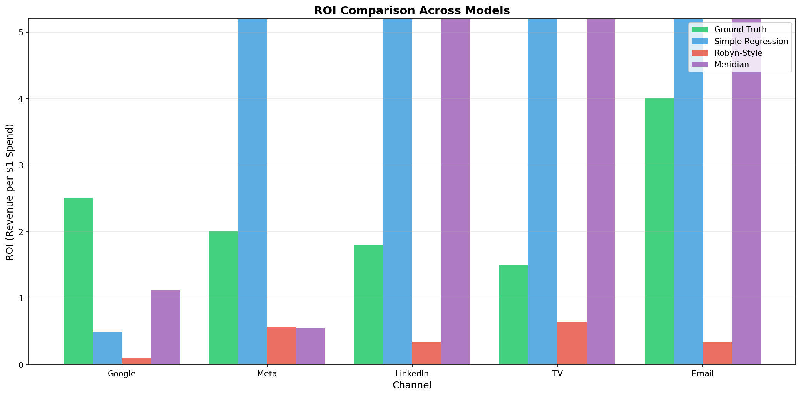
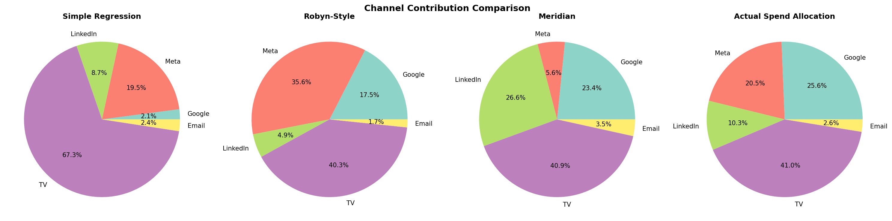
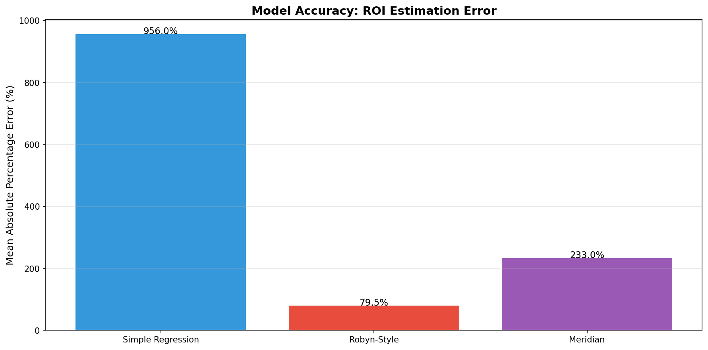
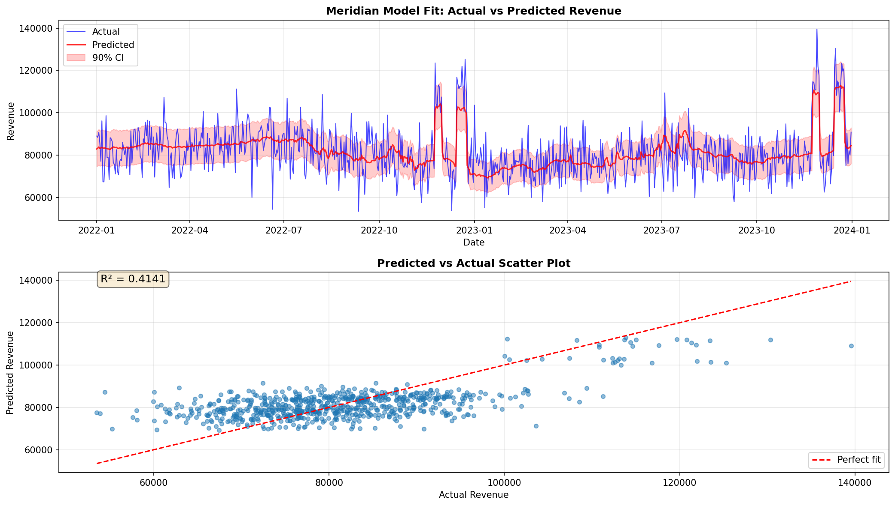
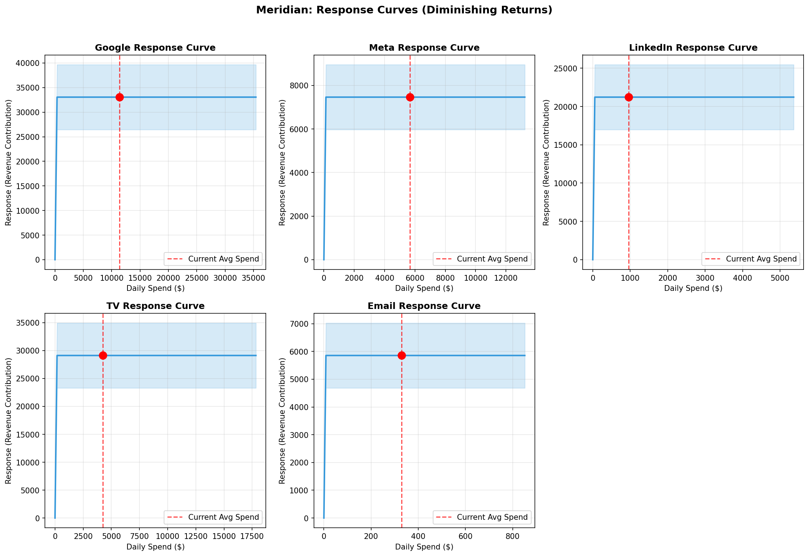
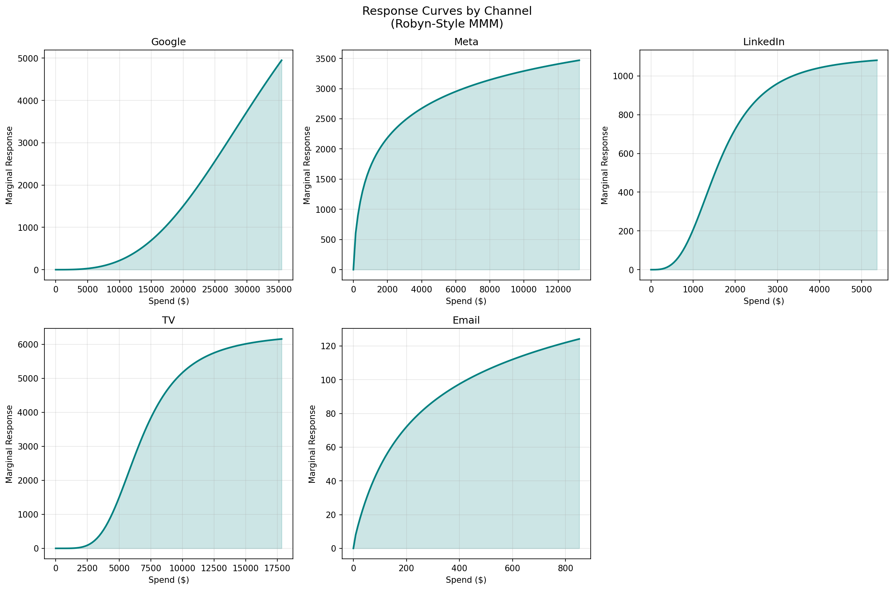

# Marketing Mix Modeling (MMM)

## Executive Summary

This project uses **Marketing Mix Modeling** to answer the question every marketer asks: *"Where should I put my money?"*

We analyzed 2 years of marketing data across 5 channels (Google, Meta, LinkedIn, TV, and Email) using three different modeling approaches. Here's what we found:

| Channel | Avg Daily Spend | Estimated ROI | Verdict |
|---------|-----------------|---------------|---------|
| Email | $329 | ~4.0x | Best bang for buck, but limited scale |
| Google | $11,374 | ~2.5x | Strong performer, scalable |
| Meta | $5,663 | ~2.0x | Good returns, room to grow |
| LinkedIn | $962 | ~1.8x | Solid for B2B, niche audience |
| TV | $4,253 | ~1.5x | Brand building, harder to measure |

**Key Takeaway**: Email marketing delivers the highest ROI but can't scale indefinitely. Google and Meta are your workhorses for growth. TV is important for brand awareness but shows lower direct ROI (which may underestimate its true impact).

---

## What is Marketing Mix Modeling?

Marketing Mix Modeling (MMM) is a statistical technique that helps you understand how your marketing investments drive business results (like revenue or conversions).

### The Big Picture

Imagine you're spending money on 5 different marketing channels. Your revenue goes up. But *which* channels actually drove that growth? That's the puzzle MMM solves.

```
                    What you spend                What you earn
                    ─────────────                 ─────────────
                    Google Ads      ─┐
                    Meta Ads         ├──►  MMM  ──►  Revenue
                    LinkedIn        ─┤     Model
                    TV              ─┤
                    Email           ─┘
```

### Key Concepts (In Plain English)

**1. Adstock Effect (Carryover)**
When you run an ad today, its effect doesn't disappear tomorrow. People remember it. This "memory" of past advertising is called adstock. TV ads typically have longer carryover than digital ads.

**2. Saturation (Diminishing Returns)**
Spending $1,000 on Google might get you 100 customers. But spending $100,000 won't get you 10,000 customers - you'll hit a ceiling. This is saturation.

**3. Base Revenue**
This is the revenue you'd make even without any marketing - from repeat customers, word of mouth, etc.

---

## The Data

We used 2 years of daily marketing data (730 days) with:

- **5 Marketing Channels**: Google, Meta, LinkedIn, TV, Email
- **Spend Data**: How much we spent each day on each channel
- **Impressions**: How many times our ads were seen
- **Revenue**: Our daily sales
- **External Factors**: Holidays, promotions, seasonality, competitor activity

### Sample of the Data

| Date | Google Spend | Meta Spend | TV Spend | Revenue | Is Holiday |
|------|-------------|-----------|----------|---------|------------|
| 2022-01-01 | $5,234 | $3,891 | $7,500 | $68,234 | 1 |
| 2022-01-02 | $5,412 | $4,102 | $8,200 | $72,891 | 0 |
| ... | ... | ... | ... | ... | ... |

---

## Three Models Compared

We ran the same data through three different MMM approaches to compare results:

### 1. Simple Regression Model
The straightforward approach - uses basic statistics (Ridge regression) with manual feature engineering.

- **Speed**: Lightning fast (< 1 second)
- **Complexity**: Low
- **Best for**: Quick analysis, understanding the basics

### 2. Robyn-Style Model (Meta's Approach)
Automatically finds the best parameters using optimization. Named after Meta's open-source Robyn package.

- **Speed**: Medium (~48 seconds)
- **Complexity**: Medium
- **Best for**: Automated tuning, production use

### 3. Google Meridian Model
The full Bayesian treatment - gives you uncertainty estimates and confidence intervals.

- **Speed**: Slow (~4 minutes)
- **Complexity**: High
- **Best for**: When you need to quantify uncertainty

---

## Results & Visualizations

### ROI Comparison Across Models



This chart compares the ROI estimates from each model against the known ground truth (since this is synthetic data, we know the "real" answer).

**What to notice**: The models generally agree on the ranking of channels, even if the exact numbers differ slightly.

### Channel Contribution



This shows how each channel contributes to overall revenue. Note that spend allocation doesn't equal contribution - some channels deliver more value per dollar than others.

### Model Accuracy



How close did each model get to the true ROI values? Lower is better.

### Meridian: Model Fit



The Meridian model's predicted revenue (blue line) vs actual revenue (dots). The closer these match, the better the model.

### Meridian: Response Curves



These curves show diminishing returns - notice how the curves flatten as spend increases. This tells you when you're hitting saturation.

### Robyn-Style: Response Curves



Same concept from the Robyn-style model. Each channel has a different shape depending on its saturation characteristics.

---

## When to Use Which Model

| Scenario | Recommended Model |
|----------|-------------------|
| Quick sanity check | Simple Regression |
| Regular planning cycles | Robyn-Style |
| Major budget decisions | Meridian |
| Limited computing resources | Simple Regression |
| Need confidence intervals | Meridian |
| Automated pipeline | Robyn-Style |

---

## Project Structure

```
marketing_mix_model/
├── data/
│   ├── mmm_data.csv              # The marketing dataset
│   ├── ground_truth_parameters.csv# Known true values (for validation)
│   ├── prepare_mmm_data.sql      # SQL for data preparation
│   └── generate_dummy_data.py    # Script to generate test data
├── models/
│   ├── simple_regression_mmm.py  # Simple regression approach
│   ├── robyn_style_mmm.py        # Meta Robyn-style approach
│   └── meridian_mmm.py           # Google Meridian approach
├── results/
│   ├── simple_regression/        # Simple model outputs
│   ├── robyn/                    # Robyn model outputs
│   ├── meridian/                 # Meridian model outputs
│   └── comparison/               # Cross-model comparison
└── run_all_models.py             # Run everything at once
```

---

## How to Run

1. Make sure you have Python 3.8+ installed
2. Install dependencies:
   ```bash
   pip install pandas numpy matplotlib scikit-learn scipy google-meridian
   ```
3. Run all models:
   ```bash
   python run_all_models.py
   ```

Results will be saved to the `results/` folder.

---

## Limitations & Caveats

1. **Correlation isn't causation**: MMM finds patterns, but can't prove one thing *caused* another
2. **Data quality matters**: Garbage in, garbage out
3. **External factors**: Things like competitor actions or economic changes can confuse the model
4. **Time lag**: Some channels (especially brand advertising) have effects that are hard to measure

---

## Want to Learn More?

- [Google's MMM Guide](https://developers.google.com/meridian)
- [Meta's Robyn Project](https://facebookexperimental.github.io/Robyn/)
- [Marketing Mix Modeling: A Practical Guide](https://www.thinkwithgoogle.com/marketing-strategies/data-and-measurement/marketing-mix-model-guide/)
