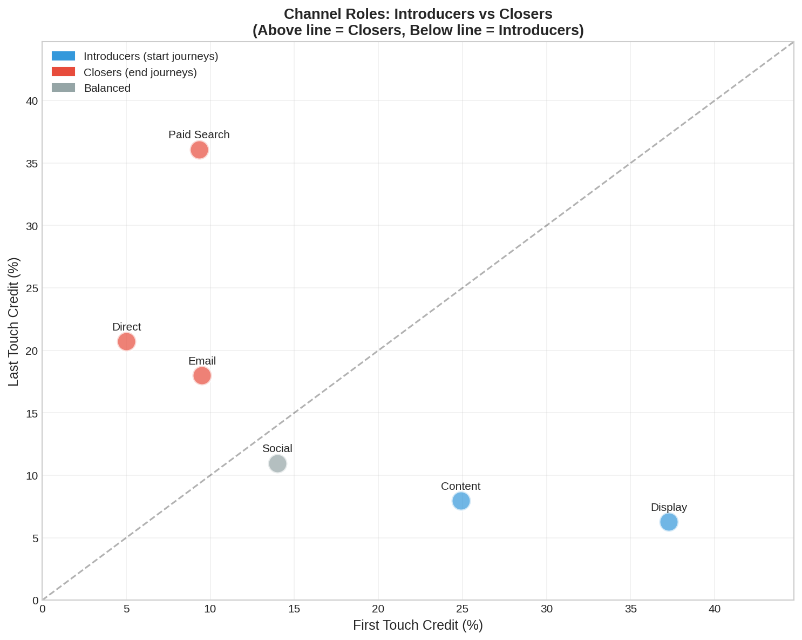
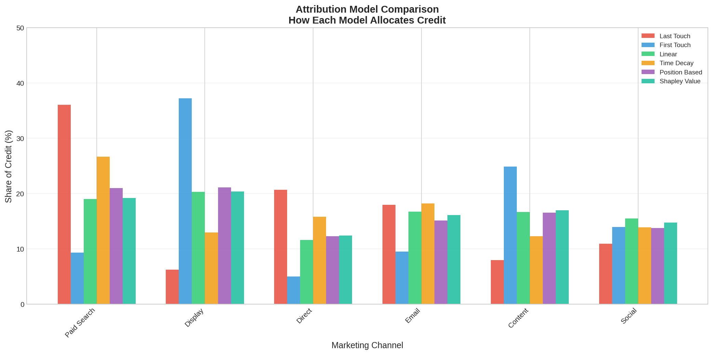
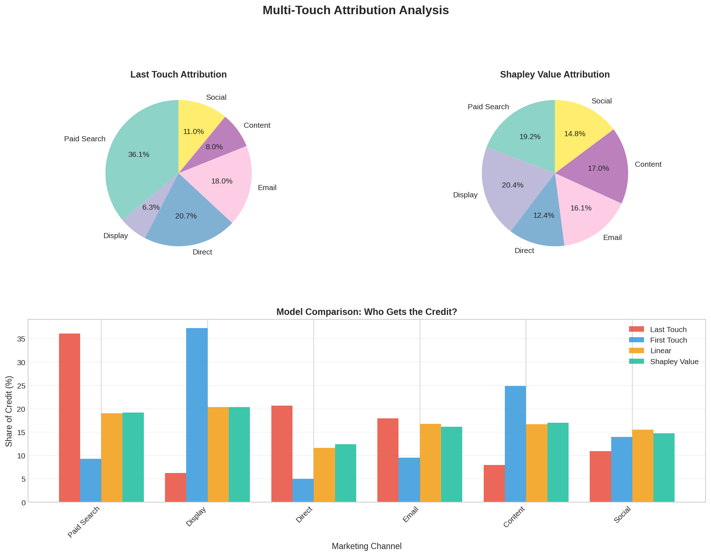

# Multi-Touch Attribution Analysis

## Executive Summary

**The Problem**: Most companies use "last-touch" attribution, which gives 100% credit to the final marketing channel before a conversion. This massively undervalues channels that introduce customers to your brand.

**What We Found**:

| Channel | Last Touch Credit | Fair Credit (Shapley) | Verdict |
|---------|-------------------|----------------------|---------|
| Display | 6.3% | 20.4% | **Severely undervalued** |
| Content | 8.0% | 17.0% | **Severely undervalued** |
| Social | 11.0% | 14.8% | Undervalued |
| Paid Search | 36.1% | 19.2% | **Overvalued** |
| Direct | 20.7% | 12.4% | Overvalued |
| Email | 18.0% | 16.1% | About right |

**The Bottom Line**: If you're using last-touch attribution, you're probably over-investing in "closer" channels (Paid Search, Direct) and under-investing in "introducer" channels (Display, Content) that bring new customers into your funnel.

---

## The Hidden Value Problem

Here's the issue in a nutshell:

```
Customer Journey Example:
━━━━━━━━━━━━━━━━━━━━━━━━━━━━━━━━━━━━━━━━━━━━━━━━━━━━━━━━━━━━━

  Display Ad    →    Blog Post    →    Email    →    Google Search    →    💰 Purchase
  (Day 1)            (Day 3)          (Day 7)        (Day 10)

  Last Touch:     0%              0%            0%           100%
  Fair Share:    ~25%           ~20%          ~25%          ~30%

━━━━━━━━━━━━━━━━━━━━━━━━━━━━━━━━━━━━━━━━━━━━━━━━━━━━━━━━━━━━━
```

The Display ad introduced this customer. Without it, they never would have found you. But last-touch gives it zero credit!

---

## Results Visualizations

### Last Touch vs Multi-Touch Attribution


This is the most important chart. The left side shows how different the two approaches are. The right side shows which channels gain or lose credit when you switch to multi-touch.

**Green bars** = channels that deserve more credit than last-touch gives them
**Red bars** = channels getting too much credit under last-touch

### Channel Roles: Introducers vs Closers



This scatter plot reveals each channel's role:
- **Above the diagonal line**: Closers (good at finishing sales)
- **Below the diagonal line**: Introducers (good at starting customer journeys)
- **On the line**: Balanced channels

### All Attribution Models Compared



Six different ways to slice the data. Notice how Last Touch (red) gives drastically different answers than the other models.

### Summary Dashboard



The executive view: pie charts comparing Last Touch vs Shapley, plus a bar chart of all models.

---

## Attribution Models Explained

### 1. Last Touch Attribution
**How it works**: 100% credit to the final touchpoint before conversion.

**Example**: Display → Email → Paid Search → *Purchase*
- Paid Search gets 100%, everything else gets 0%

**When to use**: Simple reporting, bottom-of-funnel optimization

**Problem**: Ignores the entire customer journey

---

### 2. First Touch Attribution
**How it works**: 100% credit to the first touchpoint.

**Example**: *Display* → Email → Paid Search → Purchase
- Display gets 100%, everything else gets 0%

**When to use**: Measuring brand awareness campaigns

**Problem**: Ignores everything that happened after initial contact

---

### 3. Linear Attribution
**How it works**: Equal credit to all touchpoints.

**Example**: Display → Email → Paid Search → Purchase
- Each channel gets 33.3%

**When to use**: When you believe all touchpoints matter equally

**Problem**: Doesn't account for position in journey

---

### 4. Time Decay Attribution
**How it works**: More credit to recent touchpoints, less to older ones.

**Example**: Display → Email → Paid Search → Purchase
- Display: 14%, Email: 29%, Paid Search: 57%

**When to use**: Short sales cycles, immediate response campaigns

**Problem**: Still undervalues introducers

---

### 5. Position-Based (U-Shaped)
**How it works**: 40% to first touch, 40% to last touch, 20% split among middle.

**Example**: Display → Email → Paid Search → Purchase
- Display: 40%, Email: 20%, Paid Search: 40%

**When to use**: When first and last interactions are most important

**Problem**: Arbitrary 40/40/20 split

---

### 6. Shapley Value (Data-Driven)
**How it works**: Uses game theory to calculate each channel's marginal contribution based on actual data patterns.

**Example**: Calculates what happens to conversion rates when each channel is present vs absent, across all combinations.

**When to use**: When you want the most accurate picture

**Problem**: More complex to explain to stakeholders

---

## The Data

We analyzed **5,000 customer journeys** with **16,341 touchpoints** resulting in **3,007 conversions**.

### Channels Analyzed
- **Display**: Banner ads, programmatic advertising
- **Content**: Blog posts, whitepapers, organic content
- **Social**: Facebook, Instagram, LinkedIn posts
- **Email**: Newsletter, promotional emails
- **Paid Search**: Google Ads, Bing Ads
- **Direct**: Direct website visits, bookmarks

### Journey Statistics
- Average journey length: 3.2 touchpoints
- Conversion rate: 60%
- Average conversion value: $90

---

## Key Takeaways

### 1. Don't Trust Last-Touch Alone
It's simple but misleading. Use it as one data point, not the whole picture.

### 2. Fund Your Introducers
Display and Content marketing are probably undervalued in your current reporting. They bring in new customers that closers convert.

### 3. Think in Journeys, Not Channels
Customers don't convert from a single ad. They interact with multiple touchpoints. Your attribution should reflect this.

### 4. Test with Incrementality
The best way to know a channel's true value is to turn it off and measure what happens. Attribution models are estimates.

---

## Project Structure

```
multi_touch_attribution/
├── generate_data.py          # Creates synthetic customer journeys
├── attribution_models.py     # All 6 attribution models
├── visualize_results.py      # Chart generation
├── run_analysis.py           # Main runner script
├── touchpoints.csv           # Raw touchpoint data
├── conversions.csv           # Conversion data
└── results/
    ├── attribution_comparison.csv
    ├── attribution_comparison.png
    ├── last_vs_shapley.png
    ├── channel_roles.png
    └── model_summary.png
```

---

## How to Run

```bash
# Run the complete analysis
python run_analysis.py

# Or run individual steps:
python generate_data.py        # Generate new data
python attribution_models.py   # Run models only
python visualize_results.py    # Create charts only
```

---

## Further Reading

- [Google's Attribution Guide](https://support.google.com/analytics/answer/1662518)
- [The Shapley Value in Marketing](https://en.wikipedia.org/wiki/Shapley_value)
- [Multi-Touch Attribution: A Data-Driven Approach](https://hbr.org/2017/05/a-refresher-on-marketing-attribution-models)
